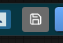
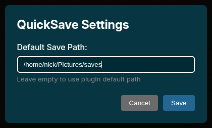

# ComfyUI QuickSave


A toolbar button for quickly saving images from ComfyUI's preview.

## Features

- One-click save from toolbar
- Automatic duplicate detection (won't save the same image twice)
- Sanitized filenames
- Configurable save location

## Installation

1. Clone or download to `ComfyUI/custom_nodes/`:
   ```bash
   cd ComfyUI/custom_nodes
   git clone https://github.com/Ckrest/comfyui-quicksave.git
   ```

2. Restart ComfyUI

3. A **QuickSave** button appears in the toolbar

## Screenshots

| Toolbar Button | Settings Dialog |
|:-:|:-:|
|  |  |

## Usage

1. Run a workflow that generates images
2. Click the **QuickSave** button in the toolbar
3. Image is saved to `ComfyUI/output/quicksave/`

## How It Works

- **Frontend (JS)**: Adds toolbar button, captures displayed image
- **Backend (Python)**: Receives image via `/quicksave` API endpoint, saves to disk

The `QuickSave` node in the node menu is a dummy node that exists only to ensure the API endpoint is registered. You don't need to add it to your workflow.

## Configuration

Images save to `ComfyUI/output/quicksave/` by default. The JS extension can be modified to change the save path.

## License

MIT License - See [LICENSE](LICENSE)
